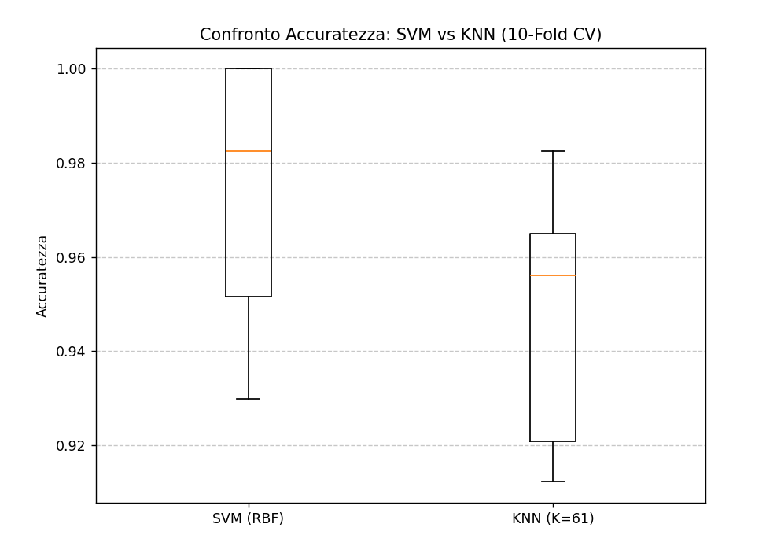

# 🩺 Diagnosi Tumori: SVM vs KNN

Analisi comparativa delle performance su dati clinici per la classificazione dei tumori al seno.

## 📋 Descrizione del Progetto

Questo progetto mette a confronto due tra i più noti algoritmi di Machine Learning (**Support Vector Machines** e **K-Nearest Neighbors**) per la classificazione binaria di tumori al seno (Maligno/Benigno). L'obiettivo è valutare quale modello offra la maggiore accuratezza e stabilità su un dataset clinico standard.

## 📊 Analisi dei Risultati

Il grafico sottostante mostra la distribuzione dell'accuratezza ottenuta tramite una **10-Fold Cross-Validation**. Questo metodo permette di verificare la stabilità dei modelli su diverse porzioni del dataset, eliminando l'influenza della casualità nella suddivisione dei dati.



### Verdetto Tecnico

Sulla base degli esperimenti condotti, i modelli hanno registrato le seguenti performance:

| Modello        | Accuratezza Media | Deviazione Standard (±) |
| :------------- | :---------------: | :---------------------: |
| **SVM (RBF)**  |      97.54%       |         0.0251          |
| **KNN (K=61)** |      94.90%       |         0.0266          |

### Conclusioni

- **SVM** si conferma il modello superiore per questo dataset, offrendo non solo un'accuratezza media più elevata, ma anche una consistenza maggiore (varianza minore nei risultati).
- **KNN** raggiunge ottimi risultati con un K=61, ma tende a essere leggermente meno preciso nelle zone di confine tra le classi rispetto all'approccio a "margine massimo" della SVM.

## 🛠️ Stack Tecnologico

- **Linguaggio:** Python 3.x
- **Librerie:**

  - `scikit-learn`: Implementazione degli algoritmi e validazione incrociata.

  - `matplotlib`: Visualizzazione statistica tramite Boxplot.

## ⚙️ Configurazione dei Modelli

Per garantire un confronto equo, i dati sono stati normalizzati utilizzando `StandardScaler`.

- **Dataset:** breast_cancer (Scikit-learn built-in).
- **SVM:** Kernel RBF, C=1.0, gamma=0.01.
- **KNN:** Numero di vicini K=61 (ottimizzato sperimentalmente).

## 🚀 Come replicare i risultati

1.  Clona la repository.
2.  Assicurati di avere installato le dipendenze:
    ```bash
    pip install scikit-learn matplotlib
    ```
3.  Esegui lo script principale:
    ```bash
    python mini_progetto.py
    ```
